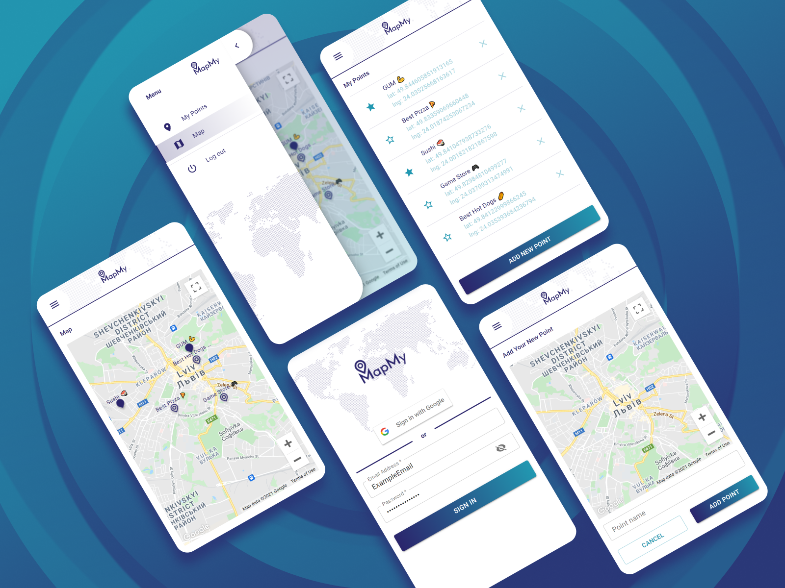

# MapMy

Map My is a mobile web application for creating map markers for your favorite places.

## Demo

https://alexvilbitskyi.github.io/MapMy/

## Built With

* [React](https://pl.reactjs.org/)
* [React Router](https://reactrouter.com/)
* [Material-UI](https://material-ui.com/)
* [Google Map React](https://github.com/google-map-react/google-map-react)
* [React Google Login](https://www.npmjs.com/package/react-google-login)
* [react-transition-group](https://www.npmjs.com/package/react-transition-group)

## Installation

1. Clone the repo
   ```sh
   git clone https://github.com/AlexVilbitskyi/MapMy.git
   ```
2. Install NPM packages
   ```sh
   npm install
   ```
3. Run app
   ```sh
   npm start
   ```

## Contributing

Pull requests are welcome. For major changes, please open an issue first to discuss what you would like to change.

Please make sure to update tests as appropriate.

## License

Distributed under the MIT License.